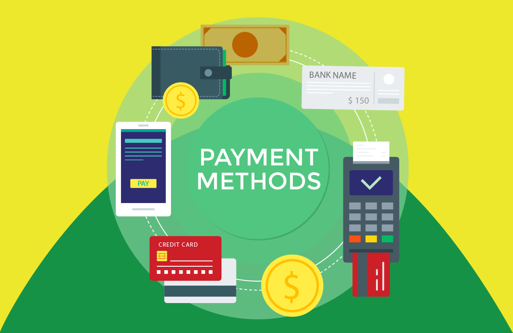
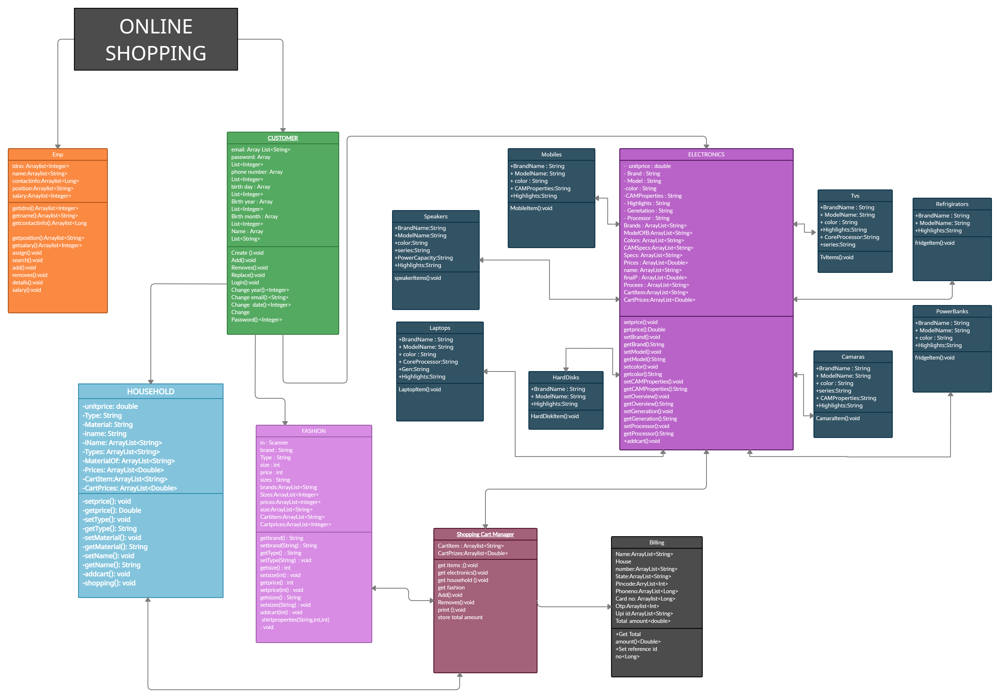

# **ONLINE SHOPPING**

## Introduction 

It is a basic online shopping project mainly built with all basic syntax of ***JAVA***, covered with all the main things which are there to be in a real online shopping project. In this program the main class will control all the other class

## Classes involved 

There are a total of 7 classes included in this program
> 1. **Employee class**

This class will control all the details of the employees.

> 2. **User account creditals & Customer class**

This class will verify the customer details and give access to the customer for creating an account and logging in account.

> 3. **Electronics class**

In this class there are set of electronics items along with some brands. the customer can choose his favorite electronics things
- Mobile’s
- Laptop’s
- Tv’s
- Speakers
- Cameras
- Hard disk
- Power bank
- Refrigerator

> 4. **Fashion class**

In this class clothing's for men and wommen will be available
- Mens fashion
- - Shirts
- - Pants
- - tshirts
- - Jackets
- - Shoes
- - Backpacks
- - Shorts
- Womens fashion
- - Sarees
- - leggings

> 5. **Household items class**

In this class some household items
- Beds
- Cupboards
- Tables 
- Sofa
- Chair
- Curtains
- Carpets

> 6. **Cart class**

All the Items selected by the customer will be stored into cart.

> 7. **Billing Class**

The customer can choose any types of payment methods.

## UML Class Diagram

